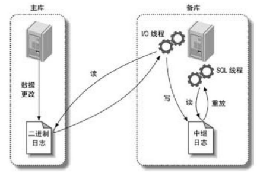

# MySQL

## # MySQL 存储引擎

> [《高性能 MySQL》- 第 1 章 MySQL 架构与历史](https://book.douban.com/subject/23008813/)

### InnoDB 存储引擎

InnoDB 是 MySQL 的默认事务型引擎，也是最重要、使用最广泛的存储引擎。它被设计用来处理大量的短期（short-lived）事务，短期事务大部分情况是正常提交的，很少会被回滚。InnoDB 的性能和自动崩溃恢复特性，使得它在非事务型存储的需求中也很流行。

InnoDB 采用 MVCC 来支持高并发，并且实现了四个标准的隔离级别。其默认级别是REPEATABLE READ（可重复读），并且通过间隙锁（next-key locking）策略防止幻读的出现。间隙锁使得 InnoDB 不仅仅锁定查询涉及的行，还会对索引中的间隙进行锁定，以防止幻影行的插入。

### MyISAM 存储引擎

MyISAM 提供了大量的特性，包括全文索引、压缩、空间函数（GIS）等，但 MyISAM 不支持事务和行级锁，而且有一个毫无疑问的缺陷就是崩溃后无法安全恢复。对于只读的数据，或者表比较小、可以忍受修复（repair）操作，则依然可以继续使用 MyISAM。

### 部分引擎对比

|  存储引擎   |  事务  |        锁粒度        |            主要应用            |           忌用           |
| :---------: | :----: | :------------------: | :----------------------------: | :----------------------: |
|   InnoDB    |  支持  |   支持MVCC的行级锁   |            事务处理            |            无            |
|   MyISAM    | 不支持 | 支持并发操作的表级锁 |         SELECT、INSERT         |       读写操作频繁       |
| MRG_MYISAM  | 不支持 | 支持并发插入的表级锁 |       分段归档、数据仓库       |    全局查找过多的场景    |
|   Archive   | 不支持 |        行级锁        | 日志记录、只支持insert、select | 需要随机读取，更新，删除 |
| NDB Cluster |  支持  |        行级锁        |            高可用性            |        大部分应用        |

### 引擎的选取因素

- **事务**

  如果应用需要事务支持，那么 InnoDB 是目前最稳定并且经过验证的选择。如果不需要事务，并且主要是 SELECT 和 INSERT 操作，那么 MyISAM 是不错的选择。一般日志型的应用比较符合这一特性。

- **备份**

  备份的需求也会影响存储引擎的选择。如果可以定期地关闭服务器来执行备份，那么备份的因素可以忽略。反之，如果需要在线热备份，那么选择 InnoDB 就是基本的要求。

- **崩溃恢复**

  数据量比较大的时候，系统崩溃后如何快速地恢复是一个需要考虑的问题。相对而言，MyISAM 崩溃后发生损坏的概率比 InnoDB 要高很多，而且恢复速度也要慢。。

- **特有的特性**

  最后，有些应用可能依赖一些存储引擎所独有的特性或者优化，比如很多应用依赖聚簇索引的优化。另外，MySQL中也只有 MyISAM 支持地理空间搜索。如果一个存储引擎拥有一些关键的特性，同时却又缺乏一些必要的特性，那么有时候不得不做折中的考虑，或者在架构设计上做一些取舍。某些存储引擎无法直接支持的特性，有时候通过变通也可以满足需求。

## # 主从复制

> [《高性能 MySQL》- 第 10 章 复制](https://book.douban.com/subject/23008813/)

### 概述

MySQL支持两种复制方式：基于行的复制和基于语句的复制。这两种方式都是通过在主库上记录二进制日志、在备库重放日志的方式来实现异步的数据复制。

### 复制解决的问题

- **数据分布**

  可以在不同的地理位置分布数据备份，例如不同的数据中心。

- **负载均衡**

  通过MySQL复制可以将读操作分布到多个服务器上，实现对读密集型应用的优化，并且实现很方便，通过简单的代码修改就能实现基本的负载均衡。

- **备份**

  对于备份来说，复制是一项很有意义的技术补充，但复制既不是备份也不能够取代备份。

- **高可用和故障切换**

  复制能够帮助应用程序避免MySQL单点失败，一个包含复制的设计良好的故障切换系统能够显著地缩短宕机时间。

- **MySQL升级测试**

  使用一个更高版本的MySQL作为备库，保证在升级全部实例前，查询能够在备库按照预期执行。

### 复制如何工作

总的来说，MySQL的复制有三个步骤：

1. 在主库上把数据更改记录到二进制日志（Binary Log）中（这些记录被称为二进制日志事件）。
2. 备库将主库上的日志复制到自己中继日志（Relay Log）中。
3. 备库读取中继日志中的事件，将其重放到数据之上。

