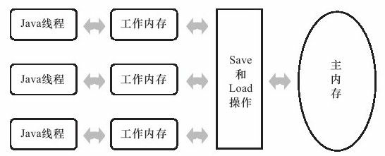

# JVM

## # Java 内存区域

> [《深入理解 Java 虚拟机》- 第 2 章 Java内存区域与内存溢出异常](https://book.douban.com/subject/24722612/)

根据《Java虚拟机规范（Java SE 7版）》的规定，Java虚拟机所管理的内存将会包括以下几个运行时数据区域，如图所示。

+ 程序计数器（Program Counter Register）是一块较小的内存空间，它可以看作是当前线程所执行的字节码的行号指示器。为了线程切换后能恢复到正确的执行位置，每条线程都需要有一个独立的程序计数器，各条线程之间计数器互不影响，独立存储，我们称这类内存区域为“线程私有”的内存。
+ Java 虚拟机栈（Java Virtual Machine Stacks）也是线程私有的，它的生命周期与线程相同。虚拟机栈描述的是 Java 方法执行的内存模型：每个方法在执行的同时都会创建一个栈帧（Stack Frame）用于存储局部变量表、操作数栈、动态链接、方法出口等信息。每一个方法从调用直至执行完成的过程，就对应着一个栈帧在虚拟机栈中入栈到出栈的过程。
+ 本地方法栈（Native Method Stack）与虚拟机栈所发挥的作用是非常相似的，它们之间的区别不过是虚拟机栈为虚拟机执行 Java 方法（也就是字节码）服务，而本地方法栈则为虚拟机使用到的 Native 方法服务。
+ 对于大多数应用来说，Java 堆（Java Heap）是 Java 虚拟机所管理的内存中最大的一块。Java 堆是被所有线程共享的一块内存区域，在虚拟机启动时创建。此内存区域的唯一目的就是存放对象实例，几乎所有的对象实例都在这里分配内存。Java 堆是垃圾收集器管理的主要区域，因此很多时候也被称做“GC 堆”（Garbage Collected Heap）。
+ 方法区（Method Area）与 Java 堆一样，是各个线程共享的内存区域，它用于存储已被虚拟机加载的类信息、常量、静态变量、即时编译器编译后的代码等数据。

## # 持有引用

> [《Thinking in Java》- 第17章 容器深入研究](https://book.douban.com/subject/2130190/)
>
> [《深入理解 Java 虚拟机》- 第3章 垃圾收集器与内存分配策略](https://book.douban.com/subject/24722612/)

java.lang.ref 类库包含了一组类，这些类为垃圾回收提供了更大的灵活性。当存在可能会耗尽内存的大对象的时候，这些类显得特别有用。有三个继承自抽象类 Reference 的类：**SoftReference（软引用）**、**WeakReference（弱引用）**和 **PhantomReference（虚引用）**。当垃圾回收器正在考察的对象只能通过某个 Reference 对象才“可获得”时，上述这些不同的派生类为垃圾回收器提供了不同级别的间接性指示。

在JDK 1.2之后，Java对引用的概念进行了扩充，将引用分为强引用（Strong Reference）、软引用（Soft Reference）、弱引用（Weak Reference）、虚引用（Phantom Reference）4种，这4种引用强度依次逐渐减弱。

- **强引用**就是指在程序代码之中普遍存在的，类似“Object obj=new Object（）”这类的引用，只要强引用还存在，垃圾收集器永远不会回收掉被引用的对象。
- **软引用**是用来描述一些还有用但并非必需的对象。对于软引用关联着的对象，在系统将要发生内存溢出异常之前，将会把这些对象列进回收范围之中进行第二次回收。如果这次回收还没有足够的内存，才会抛出内存溢出异常。在JDK 1.2之后，提供了SoftReference类来实现软引用。
- **弱引用**也是用来描述非必需对象的，但是它的强度比软引用更弱一些，被弱引用关联的对象只能生存到下一次垃圾收集发生之前。当垃圾收集器工作时，无论当前内存是否足够，都会回收掉只被弱引用关联的对象。在JDK 1.2之后，提供了WeakReference类来实现弱引用。
- **虚引用**也称为幽灵引用或者幻影引用，它是最弱的一种引用关系。一个对象是否有虚引用的存在，完全不会对其生存时间构成影响，也无法通过虚引用来取得一个对象实例。为一个对象设置虚引用关联的唯一目的就是能在这个对象被收集器回收时收到一个系统通知。在JDK 1.2之后，提供了PhantomReference类来实现虚引用。

## # 垃圾收集算法

> [《深入理解 Java 虚拟机》- 第 3 章 垃圾收集器与内存分配策略](https://book.douban.com/subject/24722612/)

1.可达性分析算法

通过一系列的称为“GC Roots”的对象作为起始点，从这些节点开始向下搜索，搜索所走过的路径称为引用链（Reference Chain），当一个对象到 GC Roots 没有任何引用链相连（用图论的话来说，就是从 GC Roots 到这个对象不可达）时，则证明此对象是不可用的。如图3-1所示，对象 object 5、object 6、object 7 虽然互相有关联，但是它们到 GC Roots 是不可达的，所以它们将会被判定为是可回收的对象。

在 Java 语言中，可作为 GC Roots 的对象包括：虚拟机栈（栈帧中的本地变量表）中引用的对象；方法区中类静态属性引用的对象；方法区中常量引用的对象；本地方法栈中 JNI（即一般说的Native方法）引用的对象。

2.垃圾收集算法

+ 标记-清除算法

  + 算法分为“标记”和“清除”两个阶段：首先标记出所有需要回收的对象，在标记完成后统一回收所有被标记的对象。
  + 主要不足有两个：一个是效率问题，标记和清除两个过程的效率都不高；另一个是空间问题，标记清除之后会产生大量不连续的内存碎片，空间碎片太多可能会导致以后在程序运行过程中需要分配较大对象时，无法找到足够的连续内存而不得不提前触发另一次垃圾收集动作。

+ 标记-整理算法

  + 标记过程仍然与“标记-清除”算法一样，但后续步骤不是直接对可回收对象进行清理，而是让所有存活的对象都向一端移动，然后直接清理掉端边界以外的内存。

+ 复制算法

  + 为了解决效率问题，一种称为“复制”（Copying）的收集算法出现了，它将可用内存按容量划分为大小相等的两块，每次只使用其中的一块。当这一块的内存用完了，就将还存活着的对象复制到另外一块上面，然后再把已使用过的内存空间一次清理掉。
  + 这样使得每次都是对整个半区进行内存回收，内存分配时也就不用考虑内存碎片等复杂情况，只要移动堆顶指针，按顺序分配内存即可，实现简单，运行高效。代价是将内存缩小为了原来的一半。

+ 分代收集算法

  这种算法并没有什么新的思想，只是根据对象存活周期的不同将内存划分为几块。一般是把 Java 堆分为新生代和老年代，这样就可以根据各个年代的特点采用最适当的收集算法。

  - 在新生代中，每次垃圾收集时都发现有大批对象死去，只有少量存活，那就选用复制算法，只需要付出少量存活对象的复制成本就可以完成收集。
  - 而老年代中因为对象存活率高、没有额外空间对它进行分配担保，就必须使用“标记—清除”或者“标记—整理”算法来进行回收。

## # 类加载

> [《深入理解 Java 虚拟机》- 第 7 章 虚拟机类加载机制](https://book.douban.com/subject/24722612/)

类从被加载到虚拟机内存中开始，到卸载出内存为止，它的整个生命周期包括：加载（Loading）、验证（Verification）、准备（Preparation）、解析（Resolution）、初始化（Initialization）、使用（Using）和卸载（Unloading）7个阶段。其中验证、准备、解析3个部分统称为连接（Linking），这7个阶段的发生顺序如图所示。

+ 在加载阶段，虚拟机需要完成以下3件事情：
  + 通过一个类的全限定名来获取定义此类的二进制字节流。
  + 将这个字节流所代表的静态存储结构转化为方法区的运行时数据结构。
  + 在内存中生成一个代表这个类的java.lang.Class对象，作为方法区这个类的各种数据的访问入口。
+ 验证是连接阶段的第一步，这一阶段的目的是为了确保Class文件的字节流中包含的信息符合当前虚拟机的要求，并且不会危害虚拟机自身的安全。
+ 准备阶段是正式为类变量（被static修饰的变量）分配内存并设置类变量初始值的阶段，这些变量所使用的内存都将在方法区中进行分配。
+ 解析阶段是虚拟机将常量池内的符号引用替换为直接引用的过程。
  + 符号引用（Symbolic References）：符号引用以一组符号来描述所引用的目标，符号可以是任何形式的字面量，只要使用时能无歧义地定位到目标即可。
  + 直接引用（Direct References）：直接引用可以是直接指向目标的指针、相对偏移量或是一个能间接定位到目标的句柄。
+ 类初始化阶段是类加载过程的最后一步，到了该阶段，才真正开始执行类中定义的Java程序代码（或者说是字节码）。

## # 双亲委派模型

> [《深入理解 Java 虚拟机》- 第 7 章 虚拟机类加载机制](https://book.douban.com/subject/24722612/)

图中展示的类加载器之间的这种层次关系，称为类加载器的双亲委派模型（Parents Delegation Model）。双亲委派模型要求除了顶层的启动类加载器外，其余的类加载器都应当有自己的父类加载器。这里类加载器之间的父子关系一般不会以继承（Inheritance）的关系来实现，而是都使用组合（Composition）关系来复用父加载器的代码。

双亲委派模型的工作过程是：如果一个类加载器收到了类加载的请求，它首先不会自己去尝试加载这个类，而是把这个请求委派给父类加载器去完成，每一个层次的类加载器都是如此，因此所有的加载请求最终都应该传送到顶层的启动类加载器中，只有当父加载器反馈自己无法完成这个加载请求（它的搜索范围中没有找到所需的类）时，子加载器才会尝试自己去加载。

使用双亲委派模型来组织类加载器之间的关系，有一个显而易见的好处就是 Java 类随着它的类加载器一起具备了一种带有优先级的层次关系。例如类 java.lang.Object，它存放在 rt.jar 之中，无论哪一个类加载器要加载这个类，最终都是委派给处于模型最顶端的启动类加载器进行加载，因此 Object 类在程序的各种类加载器环境中都是同一个类。相反，如果没有使用双亲委派模型，由各个类加载器自行去加载的话，如果用户自己编写了一个称为 java.lang.Object 的类，并放在程序的 ClassPath 中，那系统中将会出现多个不同的 Object 类，Java 类型体系中最基础的行为也就无法保证，应用程序也将会变得一片混乱。

## # Java 内存模型

> [《深入理解 Java 虚拟机》- 第 12 章 Java 内存模型与线程](https://book.douban.com/subject/24722612/)

Java 内存模型屏蔽掉了各种硬件和操作系统的内存访问差异，以实现让Java程序在各种平台下都能达到一致的内存访问效果。

Java内存模型规定了所有的变量都存储在主内存（Main Memory）中。每条线程还有自己的工作内存（Working Memory），线程的工作内存中保存了被该线程使用到的变量的主内存副本拷贝，线程对变量的所有操作（读取、赋值等）都必须在工作内存中进行，而不能直接读写主内存中的变量。不同的线程之间也无法直接访问对方工作内存中的变量，线程间变量值的传递均需要通过主内存来完成，线程、主内存、工作内存三者的交互关系如图：

Java 内存模型是围绕着在并发过程中如何处理原子性、可见性和有序性这 3 个特征来建立的：

- 原子性（Atomicity）：由 Java 内存模型来直接保证的原子性变量操作包括 read、load、assign、use、store和write，我们大致可以认为基本数据类型的访问读写是具备原子性的。

  同步块—— synchronized 块之间的操作也具备原子性。

- 可见性（Visibility）：可见性是指当一个线程修改了共享变量的值，其他线程能够立即得知这个修改。

  - volatile：保证了新值能立即同步到主内存，以及每次使用前立即从主内存刷新。
  - synchronized：同步块的可见性是由“对一个变量执行unlock 操作之前，必须先把此变量同步回主内存中”这条规则获得的。
  - final：被 final 修饰的字段在构造器中一旦初始化完成，并且构造器没有把“this”的引用传递出去，那在其他线程中就能看见final字段的值。

- 有序性（Ordering）：如果在本线程内观察，所有的操作都是有序的；如果在一个线程中观察另一个线程，所有的操作都是无序的。前半句是指“线程内表现为串行的语义”（Within-Thread As-If-Serial Semantics），后半句是指“指令重排序”现象和“工作内存与主内存同步延迟”现象。

  Java语言提供了 volatile 和 synchronized 两个关键字来保证线程之间操作的有序性：

  - volatile：关键字本身就包含了禁止指令重排序的语义。
  - synchronized：是由“一个变量在同一个时刻只允许一条线程对其进行lock操作”这条规则获得的，这条规则决定了持有同一个锁的两个同步块只能串行地进入。

## # Q&A

