# 设计模式

> [《设计模式的艺术》](https://book.douban.com/subject/20493657/)
>
> [史上最全设计模式导学目录](https://blog.csdn.net/lovelion/article/details/17517213)

## 面向对象的设计原则

| 设计原则名称                                        | 定义                                             |
| --------------------------------------------------- | ------------------------------------------------ |
| 单一职责原则 (Single Responsibility Principle, SRP) | 一个类只负责一个功能领域中的相应职责             |
| 开闭原则 (Open-Closed Principle, OCP)               | 软件实体应对扩展开放，而对修改关闭               |
| 里氏代换原则 (Liskov Substitution Principle, LSP)   | 所有引用基类对象的地方能够透明地使用其子类的对象 |
| 依赖倒转原则 (Dependence  Inversion Principle, DIP) | 抽象不应该依赖于细节，细节应该依赖于抽象         |
| 接口隔离原则 (Interface Segregation Principle, ISP) | 使用多个专门的接口，而不使用单一的总借口         |
| 合成复用原则 (Composite Reuse Principle, CRP)       | 尽量使用对象组合，而不是继承来达到复用的目的     |
| 迪米特法则 (Law of Demeter, LoD)                    | 一个软件实体应当尽可能少地与其他实体发生相互作用 |

## 创建型模式

### 简单工厂模式


### 工厂方法模式


### 抽象工厂模式


### 单例模式


```java
/**
 * 枚举实现的单例模式，代码简洁，线程安全，枚举单例可以自己处理序列化
 */
private static enum Singleton{
    INSTANCE;
}
/**
 * 扩展写法
 */
public class EnumSingleton{
    private EnumSingleton(){}
    
    public static EnumSingleton getInstance(){
        return Singleton.INSTANCE.getInstance();
    }
    
    private static enum Singleton{
        INSTANCE;
  
        private EnumSingleton singleton;
        
        private Singleton(){
            singleton = new EnumSingleton();
        }
        
        public EnumSingleton getInstance(){
            return singleton;
        }
    }
}
```

### 原型模式


### 构建者模式


## 结构型模式

### 适配器模式


### 桥接模式


### 组合模式


### 装饰模式

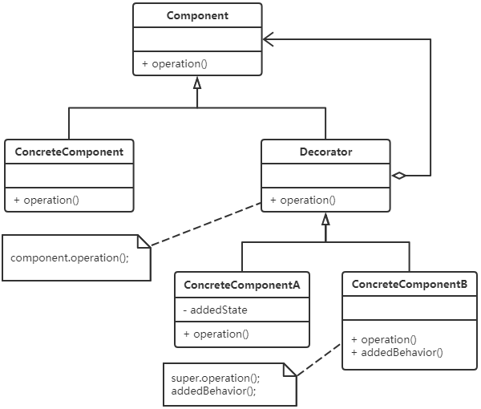

### 外观模式


### 享元模式


### 代理模式

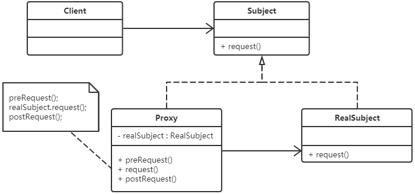

## 行为型模式

### 职责链模式

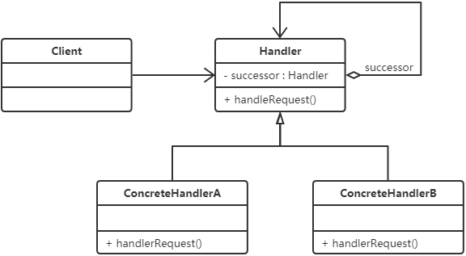

### 命令模式

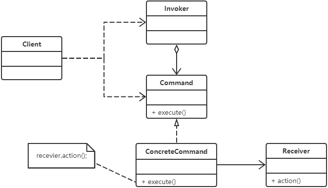

### 解释器模式

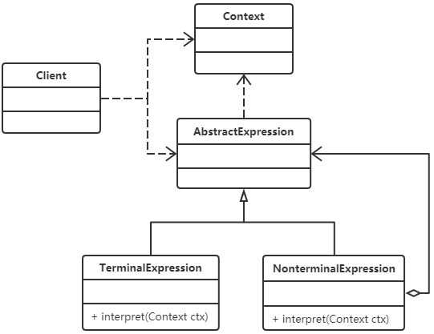

### 迭代器模式

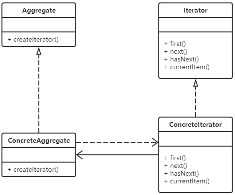

### 中介者模式

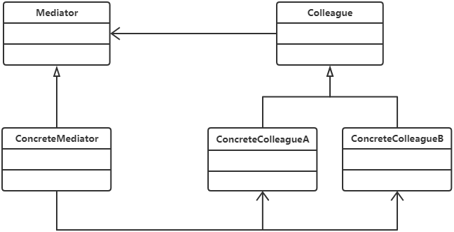

### 备忘录模式

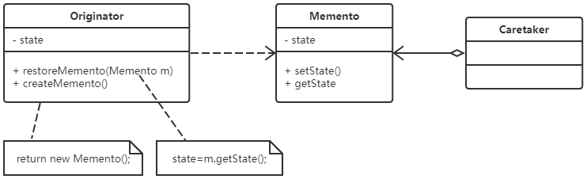

### 观察者模式

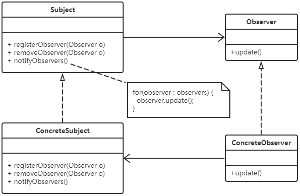

### 状态模式

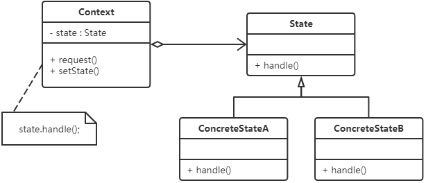

### 策略模式


### 模板方法模式

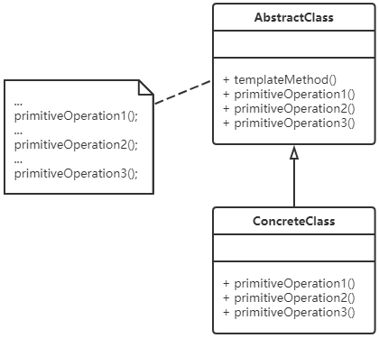

### 访问者模式

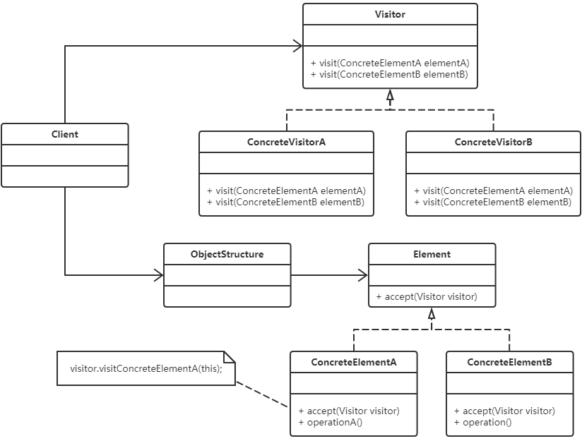

## 设计模式之间的联系

